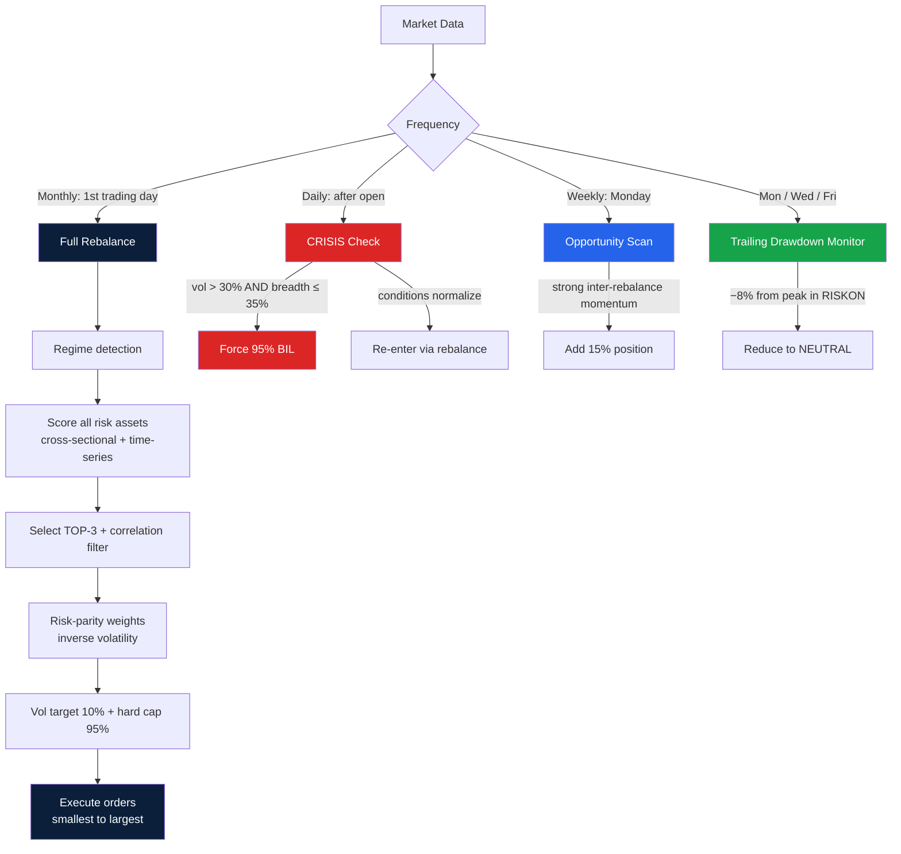
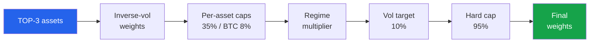
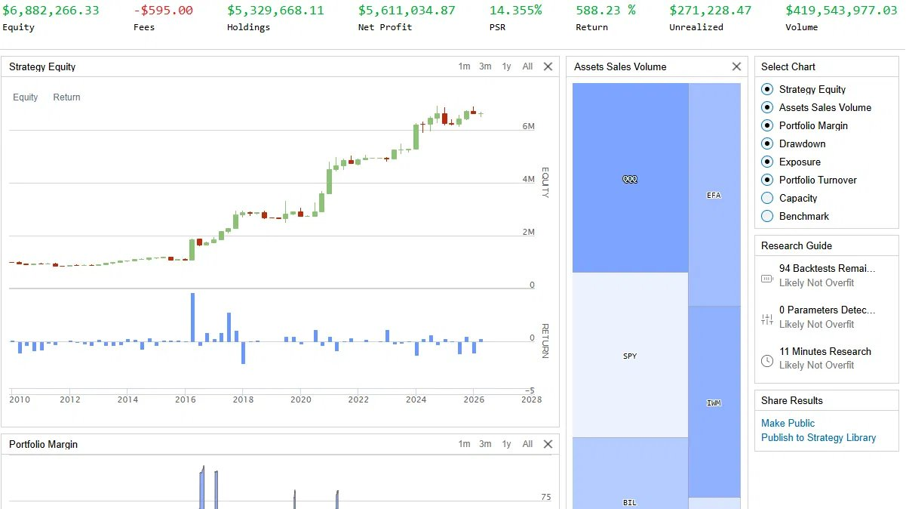
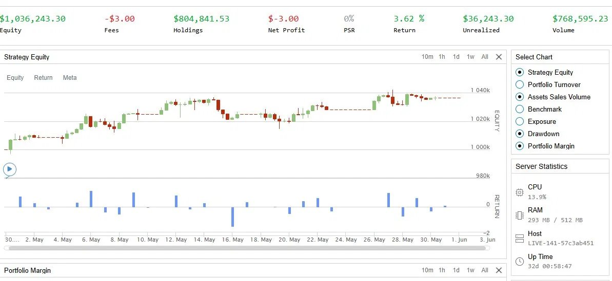

# AI Capital

**A systematic cross-asset momentum strategy with regime detection and capital protection.**

Built and operated by [Wendenda Nathanael Kaboré](#about) — PhD candidate in Electronic Engineering (deep reinforcement learning for wireless systems), National Taipei University of Technology.

---

## TL;DR

AI Capital is a fully systematic trading strategy that allocates dynamically across 6 risk assets and 3 defensive assets based on market regime. It is built on the QuantConnect / LEAN engine in Python, backtested over 16 years (2010–2026), and currently running in **live paper trading** to build an out-of-sample track record.

| | Backtest (2010–2026) |
|---|---|
| CAGR | 12.46% |
| Max Drawdown | −17.1% |
| Sharpe Ratio | 0.633 |
| Sortino Ratio | 0.67 |
| Calmar Ratio | 0.729 |
| Beta vs SPY | 0.325 |

> **On backtests:** These are backtest results. I treat backtests as *hypotheses, not proof* — they are vulnerable to overfitting. That is precisely why I deployed the strategy in live paper trading in May 2026, to validate behavior out-of-sample on data the model has never seen. See [Live Tracking](docs/live-tracking.md).

---

## Why this project exists

Most retail investing is either passive (buy-and-hold index) or discretionary (emotional, inconsistent). AI Capital is an attempt to bring **institutional-grade systematic discipline** to a transparent, explainable strategy:

- **Rules-based, not discretionary** — every decision is driven by code, not emotion.
- **Capital protection first** — a daily CRISIS kill-switch and trailing-drawdown monitor prioritize not losing money over maximizing returns.
- **Explainable** — the philosophy fits in one sentence: *follow trends when they exist, protect capital when they reverse.*

The long-term goal is a capital-management vehicle accessible to underserved investors, with full transparency and verifiable track records — not the exclusivity model of traditional hedge funds.

---

## How it works (architecture)

The system makes decisions at multiple frequencies. Full detail in [docs/architecture.md](docs/architecture.md).



### The four regimes

| Regime | Condition | Risk exposure | Defensive |
|---|---|---|---|
| **RISKON** | Bullish, confirmed trend | 100% | 0% |
| **NEUTRAL** | Uncertain / consolidation | 55% | 35% |
| **RISKOFF** | Correction | 15% | 60% |
| **CRISIS** | Crash (high vol + low breadth) | 0% | 95% BIL |

Regime is determined by a 6-indicator score (price vs SMA200, SMA slope, market breadth, annualized volatility, short-term drawdown). See [methodology](docs/methodology.md).

### Asset selection

Each risk asset is scored on two dimensions:
- **Cross-sectional momentum** — relative rank vs other assets
- **Time-series momentum** — triple lookback (1m / 3m / 12m, weighted 20 / 40 / 40), volatility-normalized

The top 3 are selected (subject to a correlation filter), then weighted by **inverse volatility (risk parity)**, scaled to a 10% portfolio volatility target, and hard-capped at 95% exposure to eliminate buying-power errors.



---

## Universe

**Risk assets:** SPY, QQQ, IWM, EFA, DBC, BTCUSD (BTC capped at 8%)
**Defensive assets:** GLD, TIP, BIL

ETFs are chosen for liquidity and capacity. A cross-asset universe (vs single stocks) is a deliberate design choice — it scales to high AUM without market impact and remains explainable to non-technical investors.

---

## Results

### Backtest (2010–2026)



*Official QuantConnect backtest output (2010–2026). Flagged "Likely Not Overfit" by the platform's detection.*

Full metrics in [results/metrics-table.md](results/metrics-table.md). The strategy was selected as the best risk-adjusted version (highest Calmar ratio, 0.729) among multiple tested variants — including versions with extended universes, different concentration levels, and macro overlays, all of which were **rejected on objective backtest evidence**. This iteration-and-rejection process is documented in [methodology](docs/methodology.md).

### Live paper trading (since May 2026)



*Official QuantConnect live paper-trading dashboard. Host ID and uptime visible for authenticity.*

| Month 1 (May 2026) | Value |
|---|---|
| Return | +2.84% |
| Drawdown | −0.2% |
| Regime | RISKON |
| Regime changes | 1 |
| Manual interventions | **0** |

The strategy ran for one month with **zero manual intervention** — by design. A systematic strategy is judged over time, not on short-term noise. Detail in [docs/live-tracking.md](docs/live-tracking.md).

---

## Tech stack

- **Engine:** QuantConnect / LEAN
- **Language:** Python (pandas, numpy)
- **Execution:** scheduled rebalancing, constant fee + slippage models
- **Monitoring:** automated email reporting (rebalance alerts, CRISIS alerts, weekly heartbeat, monthly recap), regime-history tracking, anomaly detection

A representative (simplified) code sample is in [src/regime_detection_sample.py](src/regime_detection_sample.py). The full production parameters are kept private as this is an active strategy.

---

## What this project demonstrates

This repository is intended as evidence of:

1. **Systematic trading engineering** — full pipeline from signal generation to execution to monitoring.
2. **Risk management discipline** — regime detection, volatility targeting, drawdown control, crisis routing.
3. **Statistical rigor** — understanding the difference between backtest and live, rejecting variants on objective evidence, avoiding overfitting.
4. **Operational discipline** — running a live system without emotional intervention.

These are the same competencies that matter in modern quantitative research, where reinforcement learning is increasingly applied to execution, allocation, and market making — a direct bridge to my PhD work in multi-agent deep reinforcement learning.

---

## About

**Wendenda Nathanael Kaboré**
PhD candidate, Electronic Engineering — National Taipei University of Technology (NTUT)
Research: multi-agent deep reinforcement learning (MADDPG, HFL-MADRL), federated learning, UAV-assisted networks, RIS, SAGIN systems. 8 IEEE publications. NVIDIA NGC 6G Developer Program (2026).
Thesis defense: November 2026.

- ORCID: 0009-0006-8255-8711
- Email: nooptanio2007@gmail.com

> AI Capital is a personal research and engineering project, operated in paper trading. Nothing here is investment advice.

---

## Repository structure

```
ai-capital/
├── README.md                          ← you are here
├── docs/
│   ├── architecture.md                ← full system design
│   ├── methodology.md                 ← signals, academic basis, version history
│   └── live-tracking.md               ← paper trading results
├── results/
│   ├── backtest-equity.png            ← 16-year equity curve
│   ├── metrics-table.md               ← full backtest metrics
│   └── live-screenshots/              ← live paper trading evidence
├── diagrams/
│   ├── decision-flow.png              ← multi-frequency decision schema
│   └── regime-allocation.png          ← 4-regime allocation model
└── src/
    └── regime_detection_sample.py     ← illustrative code sample
```
